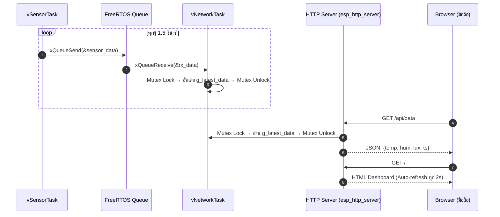

# ใบงานที่ 6.4: IoT Sensor Dashboard — แสดงผลค่าเซนเซอร์แบบ Real-Time ผ่าน Web Browser บนมือถือ

## 0. กล่าวนำ (Introduction)

ในใบงาน 6.3 นักศึกษาได้สร้างระบบ FreeRTOS Multi-Tasking ที่ `vSensorTask` อ่านค่าเซนเซอร์ → ส่งผ่าน Queue → `vNetworkTask` รับและ "เตรียม JSON" แต่ข้อมูลยังไม่ได้ออกไปสู่โลกภายนอก

ในใบงานนี้ นักศึกษาจะ**ต่อยอดโค้ด Lab 6-3 โดยตรง** โดยเพิ่ม
1. **ESP32 SoftAP** — ให้มือถือเชื่อมต่อ Wi-Fi ตรงโดยไม่ต้อง Router
2. **HTTP Web Server (`esp_http_server`)** — เปิด Endpoint 2 ตัว
   - `GET /` → หน้า Dashboard HTML Auto-refresh ทุก 2 วินาที
   - `GET /api/data` → ส่งค่า JSON ล่าสุดให้ Browser

---

## 1. วัตถุประสงค์ (Objectives)

1. เชื่อมโยง FreeRTOS Queue Pipeline กับ HTTP Web Server เพื่อส่งข้อมูลออกสู่ Browser จริง
2. ใช้งาน `esp_http_server` component ของ ESP-IDF ในการสร้าง REST API Endpoint บน ESP32
3. ออกแบบ ESP32 ให้ทำงานเป็น **SoftAP + HTTP Server** พร้อมกัน
4. เข้าใจการใช้ `SemaphoreHandle_t` (Mutex) เพื่อป้องกัน Race Condition เมื่อ HTTP Handler และ FreeRTOS Task แชร์ข้อมูลร่วมกัน

---

## 2. อุปกรณ์และซอฟต์แวร์ที่ใช้ในการทดลอง (Equipment & Tools)

1. บอร์ดไมโครคอนโทรลเลอร์ ESP32 จำนวน 1 บอร์ด
2. สายเชื่อมต่อ USB จำนวน 1 เส้น
3. สมาร์ตโฟนหรือ PC (สำหรับเปิด Browser ดู Dashboard)

---

## 3. สถาปัตยกรรมระบบ (System Architecture)



---

## 4. แนวคิดสำคัญ: Mutex ป้องกัน Race Condition

```
vNetworkTask                    HTTP GET Handler
─────────────────────────       ─────────────────────────
xSemaphoreTake(mutex)           xSemaphoreTake(mutex)
  g_latest_data = rx_data;         read g_latest_data
xSemaphoreGive(mutex)           xSemaphoreGive(mutex)
```

> [!WARNING]
> หากไม่ใช้ Mutex: HTTP Handler อาจอ่านข้อมูลขณะที่ `vNetworkTask` กำลังเขียนอยู่ ทำให้ได้ค่าที่ไม่สมบูรณ์ (Torn Read)

---

## 5. ซอร์สโค้ดการทดลอง (`main/main.c`)

ดูใน `ESP32_Project/Lab6-4-IoT-Sensor-Dashboard/main/main.c`

---

## 6. ขั้นตอนการทดลอง (Experimental Procedures)

1. Build และ Flash โค้ดลงบอร์ด ESP32
2. เปิด Serial Monitor ดู SSID และยืนยัน `[HTTP SERVER]: Started`
3. ใช้มือถือ **เชื่อมต่อ Wi-Fi ชื่อ `MY_ESP32_SENSOR_AP`** (Password: `12345678`)
4. เปิด Browser บนมือถือ แล้วไปที่ `http://192.168.4.1`
5. ควรเห็นหน้า Dashboard แสดง Temperature / Humidity / Light Lux และ Auto-refresh ทุก 2 วินาที
6. ทดสอบ JSON API โดยเปิด `http://192.168.4.1/api/data` ดู Raw JSON

ตัวอย่างหน้า browser


---

## 7. ตารางบันทึกผลการทดลอง (Experiment Results)

### 7.1 บันทึกข้อมูลจาก Dashboard

| ครั้งที่ | Temperature (°C) | Humidity (%) | Light Lux | Timestamp (ms) |
| :------: | :--------------: | :----------: | :-------: | :------------: |
|  **1**   |    26.8              |      50.2        |      409     |          216610      |
|  **2**   |      33.6            |       58.1       |     274      |         252850       |
|  **3**   |        34.0          |       65.3       |     621      |       257380         |

### 7.2 ทดสอบ JSON API (`/api/data`)

บันทึก Raw JSON Response จาก Browser:


---

## 8. คำถามท้ายการทดลอง (Post-Lab Questions)

1. เหตุใดจึงต้องใช้ **Mutex** ในการป้องกันการเข้าถึงตัวแปร `g_latest_data` ร่วมกันระหว่าง `vNetworkTask` และ HTTP Handler? ถ้าไม่ใช้จะเกิดอะไรขึ้น?
```
สาเหตุที่ต้องใช้ ตัวแปรประเภทโครงสร้างข้อมูล (Structure) หรือข้อมูลขนาดใหญ่กว่า 32-bit ไม่สามารถอ่าน/เขียนได้ในคำสั่ง Assembly เพียงคำสั่งเดียว (Non-atomic Operation) Mutex จะช่วยสร้าง Critical Section เพื่อรับประกันว่าจะไม่มี Thread อื่นเข้ามาแทรกในขณะที่กำลังอ่านหรือเขียนข้อมูล

ถ้าไม่ใช้จะเกิดอะไรขึ้น?

- Data Corruption (ข้อมูลเสียหาย) เกิดภาวะ Race Condition หาก vNetworkTask กำลังเขียนข้อมูลใหม่ลงไปครึ่งหนึ่ง แล้วถูก OS สลับไปให้ HTTP Handler อ่านข้อมูลไปส่งเว็บพอดี HTTP Handler จะได้ข้อมูลที่พิการ/ผสมกันระหว่างค่าเก่ากับค่าใหม่ (เช่น ค่า RSSI เป็นของใหม่ แต่ MAC Address เป็นของเก่า)

- Memory Crash หากข้อมูลเป็น Pointer หรือ Dynamic Memory การอ่านข้อมูลขณะกำลังถูกเปลี่ยนค่าอาจทำให้เกิด Guru Meditation Error (LoadProhibited / StoreProhibited) จน ESP32 รีเซ็ตตัวเองได้
```
2. `esp_http_server` รัน Handler บน Thread ใด — เป็น Thread เดียวกับ FreeRTOS Task ของเราหรือไม่?
```
ไม่ใช่ Thread เดียวกับ Task ของเรา esp_http_server จะสร้าง FreeRTOS Task ของตัวเองขึ้นมาต่างหาก (ชื่อ Task โดยทั่วไปคือ httpd) เพื่อทำหน้าที่เป็น Web Server รอรับ Request และประมวลผล Handler

การทำงานร่วมกัน Handler จึงเปรียบเสมือน Thread ภายนอกที่วิ่งมาขออ่านตัวแปร g_latest_data ข้าม Task จึงเป็นเหตุผลสำคัญที่ ต้องใช้ Mutex คุมการเข้าถึงตัวแปรนี้ระหว่าง Task หลักของเรากับ Task ของ httpd
```
3. การที่ Dashboard ใช้ `<meta http-equiv="refresh" content="2">` แทนที่จะใช้ JavaScript `fetch()` มีข้อดีและข้อเสียอย่างไร?
```
ข้อดี <meta http-equiv="refresh">
- เขียนง่ายมาก ไม่ต้องใช้โค้ด JS แม้แต่บรรทัดเดียว
- รองรับทุกเบราว์เซอร์ ทำงานได้แม้อยู่บนอุปกรณ์เก่ามากๆ หรือเบราว์เซอร์ที่ปิด JS
ข้อเสีย
- หน้าจอกะพริบ (Flicker) เบราว์เซอร์ต้องโหลดหน้าเว็บ HTML ใหม่ทั้งหมดทุก 2 วินาที
- เปลืองทรัพยากร ESP32 ต้องสร้างและส่งข้อความ HTML ใหม่ทั้งหน้าซ้ำๆ ทุกๆ 2 วินาที

ข้อดี JavaScript fetch() (AJAX)
- ลื่นไหล (Smooth UI) อัปเดตเฉพาะจุดโดยหน้าจอไม่กะพริบ
- ประหยัด RAM/CPU ESP32 ส่งเฉพาะข้อมูล JSON เล็กๆ ไม่ต้องส่งไฟล์ HTML ใหม่ทั้งหน้า
ข้อเสีย
- ซับซ้อนขึ้น ต้องเขียนโค้ด JS ฝั่งหน้าเว็บ และต้องทำ API Endpoint (เช่น /api/data) ฝั่ง ESP32 เพิ่มเติม

```
---

## 9. ความรู้เพิ่มเติม: ESP-IDF `esp_http_server` API

| ฟังก์ชัน                                   | ความหมาย                                     |
| :----------------------------------------- | :------------------------------------------- |
| `httpd_start(&server, &config)`            | เริ่มต้น HTTP Server (เปิด Port 80)          |
| `httpd_register_uri_handler(server, &uri)` | ลงทะเบียน Handler สำหรับ URL path            |
| `httpd_resp_send(req, buf, len)`           | ส่ง Response กลับไปยัง Browser               |
| `httpd_resp_set_type(req, type)`           | กำหนด Content-Type (เช่น `application/json`) |
| `xSemaphoreCreateMutex()`                  | สร้าง Mutex สำหรับป้องกัน Race Condition     |
| `xSemaphoreTake(mutex, ticks)`             | Lock Mutex ก่อนอ่าน/เขียน Shared Data        |
| `xSemaphoreGive(mutex)`                    | Unlock Mutex หลังเสร็จ                       |
